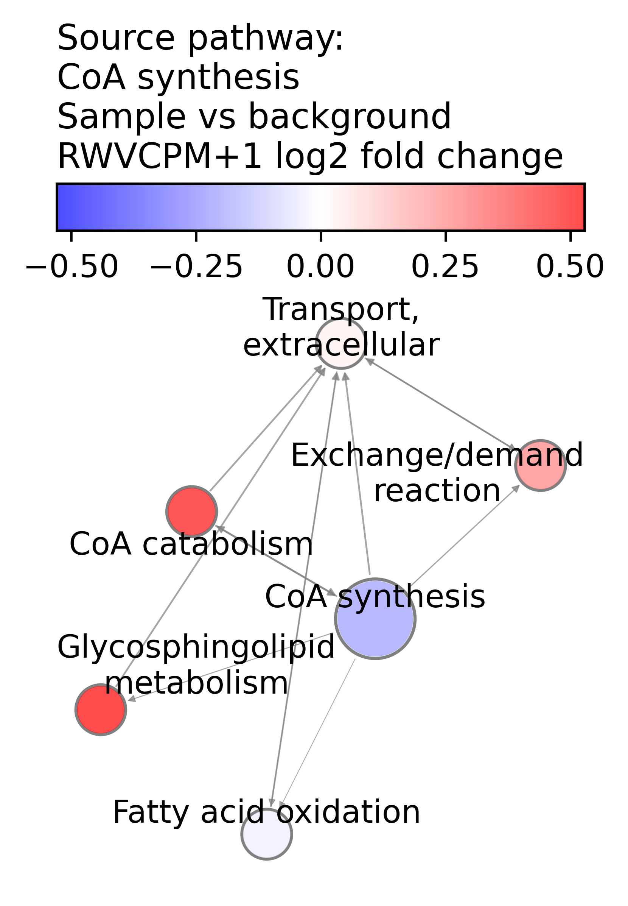
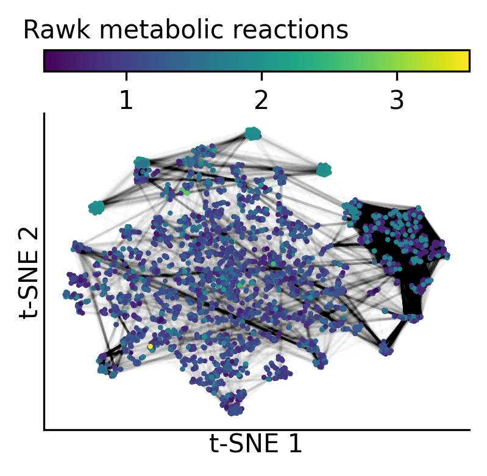
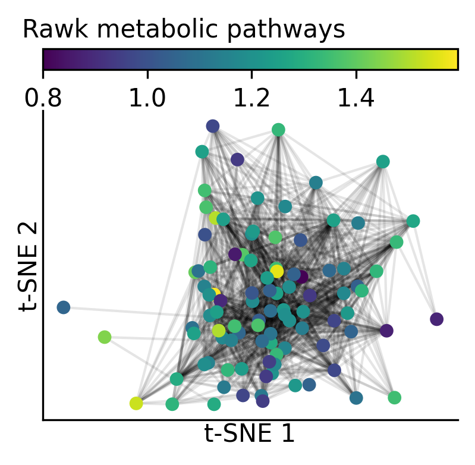
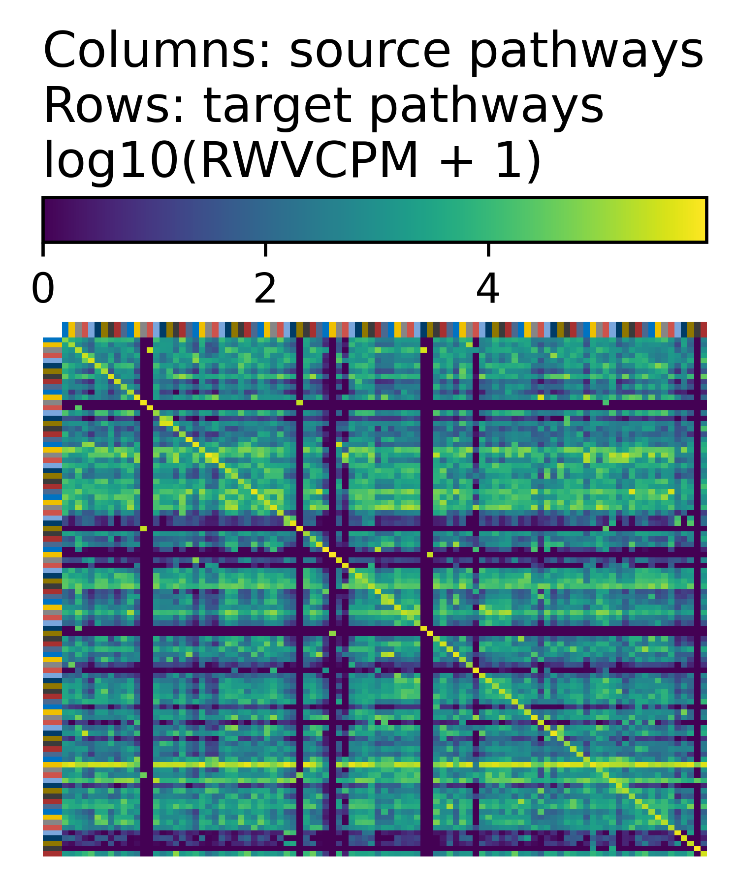

# Run Rawk on an example human dataset

This tutorial shows how to use Rawk to analyze the
Level 5 moderated z-scores of the human L1000 assay
dataset of cellular responses to chemical and genetic
perturbagens.

## Import python dependencies

```python
import rawk as rk
import pathlib
import os
import pandas as pd
import numpy as np
```


## Set up output directory

```python
out_dir = os.path.join(
    "tutorial_output",
    "example_human_data_analysis")
pathlib.Path(out_dir).mkdir(parents=True, exist_ok=True)
```

## Read input data

```python
original_data_df = pd.read_csv(
    os.path.join(
        "tutorial_data",
        "human_l1000_level5_zscores.csv"))

mrn_node_df = pd.read_table(
    os.path.join(
        "tutorial_output",
        "construct_recon3d_mrn",
        "recon3d_unfiltered_nodes.tsv"))

mrn_edge_df = pd.read_table(
    os.path.join(
        "tutorial_output",
        "construct_recon3d_mrn",
        "recon3d_pruned_edges.tsv.gz"),
    low_memory=False)
```

## Preprocess input data

```python
# Select the first gene column and one or more other
# columns for running rawk
#
# Here, select columns gene and
# LJP005_HA1E_24H_G13___HA1E___withaferin-a___10_0_um___24_h
columns_for_rawk = [
    "gene",
    "LJP005_HA1E_24H_G13___HA1E___withaferin-a___10_0_um___24_h",
]

df_for_rawk_analysis = original_data_df.loc[:, columns_for_rawk]

def preprocess_1d_arr(x):
    p = np.e ** rk.qn_transform(
        x, log1p=False, collapse_0s=False,
        center=True)
    return p


pp_node_df, pp_edge_df = rk.get_met_net_dfs(
    mrn_node_df, mrn_edge_df,
    df_for_rawk_analysis,
    # edges were pruned, so no additional filter
    0,
    fill_missing_gene_prop=None,
    transform_gene_prop_func=preprocess_1d_arr)
```

## Run Rawk

```python
msrk = rk.MultiSampleRawk(
    pp_node_df.drop(columns=["rxn_name", "equation"]),
    pp_edge_df,
    n_jobs=1,
    n2v_walk_length=20,
    n2v_num_walks=8000,
    seed=42,
)

mrn_n_genes_by_pathway = (
    mrn_node_df
    .groupby("pathway")["gene"]
    .apply(lambda x: len(set(x)))
    .to_dict()
)

pathways_for_testing = [
    p for p, n in mrn_n_genes_by_pathway.items()
    if n >= 5 and p != "Miscellaneous"]

rk_fdr_df, rk_es_df = msrk.test_num_steps(
    pw_subset=pathways_for_testing)
```

## Plot Rawk results

```python
plot_pathway = "CoA synthesis"
plot_rawk = msrk.rawk_list[0]
# each Rawk instance has a sample and a background sample
assert plot_rawk.sample.name == df_for_rawk_analysis.columns[1]
assert plot_rawk.bg_sample.name == "uniform_background"
```

```python
rk.plot_pw_neighborhood(
    plot_rawk,
    plot_pathway,
    os.path.join(
        out_dir,
        "rawk_pathway_nbr_rwv_cpm_p1_log2fc.png"),
    "rwv_cpm_p1_log2fc",
    node_color_center=0,
    n_cutoff=6, node_alpha=0.7,
    node_color_title=(
        "Sample vs background\n"
        "RWVCPM+1 log2 fold change"
    ),
    title=f"Source pathway:\n{plot_pathway}")
```



```python
rk.plot_graph(
    plot_rawk.sample.rxn_graph,
    plot_rawk.sample.rxn_pos,
    os.path.join(
        out_dir,
        "rawk_mrn_reaction_tsne.png"),
    draw_edges=True,
    non_s_pw_node_size=4,
    title="Rawk metabolic reactions",
    dim_name="t-SNE")
```



```python
pathway_pos = {
    n: d["pw_pos"]
    for n, d in plot_rawk.sample.pw_graph.nodes.items()
}
rk.plot_graph(
    plot_rawk.sample.pw_graph,
    pathway_pos,
    os.path.join(
        out_dir,
        "rawk_mrn_pathway_tsne.png"),
    node_color_attr="pw_property",
    non_s_pw_node_size=30,
    draw_edges=True,
    title="Rawk metabolic pathways",
    dim_name="t-SNE")
```



```python
rk.plot_rawk_sample_mtx(
    plot_rawk.sample,
    os.path.join(
        out_dir, "rawk_test_sample"))
```



## Save Rawk results

```python
rk_fdr_df.to_csv(
    os.path.join(out_dir, "rawk_fdr.tsv"),
    sep="\t", index=False)

rk_es_df.to_csv(
    os.path.join(out_dir, "rawk_es.tsv"),
    sep="\t", index=False)
```
